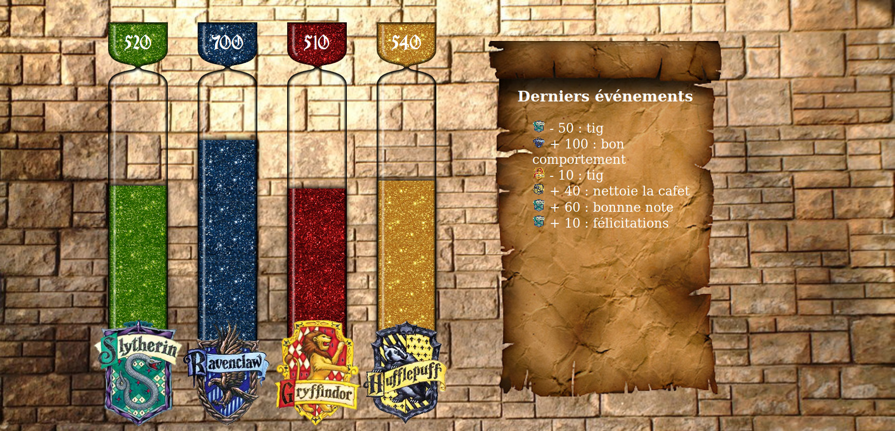

# Hogwarts

Simple Hogwarts' houses points hourglasses for Epitech's Pool.



## Install

1. Give writes to web server in storage/logs
2. Set up a MySQL database
3. Copy .env.example to .env and fill the fields
4. Run

  ```
  composer install
  php artisan migrate
  php artisan db:seed
  ```

5. Enjoy


## Install with Docker

1. Install docker
2. Run ```./start_docker.sh path```, with ```path``` the location where the mysql database will be stored
3. Wait about 30 second after the second container launch, the database may take some time to set up
4. Go to http://docker.localhost, which should resolve to localhost.

TODO: Fix with MySQL 8.0, change admin password
